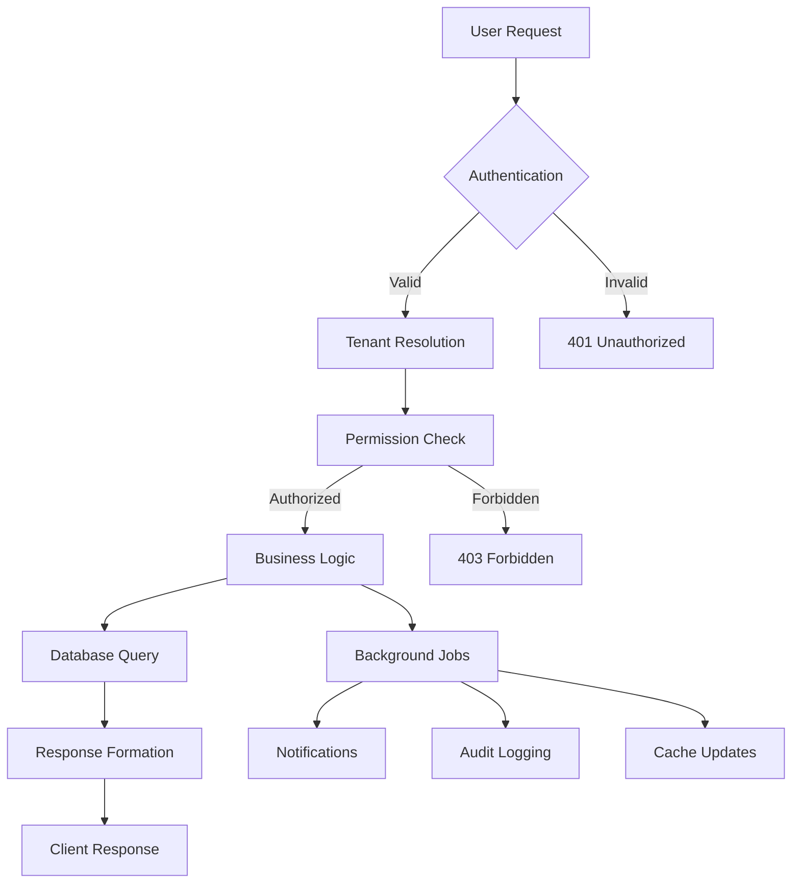

# ETrax System Architecture
## Multi-Tenant SaaS Platform Architecture

### 🏗️ Architecture Overview

ETrax is designed as a modern, scalable multi-tenant SaaS platform built with a microservices-ready monolithic architecture that can evolve into distributed services as the platform scales.

```
┌─────────────────────────────────────────────────────────────┐
│                    Frontend Layer (PWA)                     │
├─────────────────────────────────────────────────────────────┤
│  React 18 + Vite 6 + TypeScript + Tailwind CSS + PWA      │
│  • Mobile-First Responsive Design                          │
│  • Offline-First Architecture                              │
│  • Service Workers & Background Sync                       │
│  • Camera Integration (QR Scanning)                        │
│  • Voice Recognition (Web Speech API)                      │
└─────────────────────────────────────────────────────────────┘
                              │ HTTPS/WSS
                              ▼
┌─────────────────────────────────────────────────────────────┐
│                   API Gateway / Load Balancer               │
├─────────────────────────────────────────────────────────────┤
│  Nginx + PM2 + Node.js Cluster                             │
│  • SSL Termination (Let's Encrypt)                         │
│  • Rate Limiting & DDoS Protection                         │
│  • Request Routing & Load Distribution                     │
│  • WebSocket Support (Socket.IO)                           │
└─────────────────────────────────────────────────────────────┘
                              │
                              ▼
┌─────────────────────────────────────────────────────────────┐
│                  Application Layer                          │
├─────────────────────────────────────────────────────────────┤
│  Node.js 23 + Express + TypeScript                         │
│  • Multi-Tenant Request Handling                           │
│  • JWT Authentication & Authorization                      │
│  • Business Logic & Validation                             │
│  • File Upload & Processing                                │
│  • QR Code Generation                                      │
│  • Voice Command Processing                                │
│  • Email/SMS Notifications                                 │
│  • Background Job Processing                               │
└─────────────────────────────────────────────────────────────┘
                              │
                    ┌─────────┼─────────┐
                    ▼         ▼         ▼
┌─────────────────┐ ┌─────────────────┐ ┌─────────────────┐
│  Data Layer     │ │  Cache Layer    │ │ External APIs   │
│                 │ │                 │ │                 │
│ PostgreSQL 17   │ │ Redis 7.4       │ │ • Twilio (SMS)  │
│ • Multi-Tenant  │ │ • Session Store │ │ • SMTP (Email)  │
│ • ACID Comply   │ │ • Query Cache   │ │ • Puppeteer     │
│ • Backup/Replica│ │ • Rate Limiting │ │ • File Storage  │
└─────────────────┘ └─────────────────┘ └─────────────────┘
```

---

## 🏢 Multi-Tenant Architecture

### Tenant Isolation Strategy

**Database-Per-Tenant Model**: Each school/organization maintains complete data isolation through separate database schemas while sharing the same PostgreSQL instance.

```sql
-- Tenant isolation at database level
Organization (State/District/County)
├── Schools (Individual tenant instances)
│   ├── schema: school_abc123
│   │   ├── users
│   │   ├── equipment
│   │   ├── categories
│   │   ├── locations
│   │   ├── transactions
│   │   └── ...all tenant-specific tables
│   └── schema: school_xyz789
│       └── ...isolated data
```

### Hierarchical Data Model

```typescript
// Organization hierarchy for reporting
interface OrganizationHierarchy {
  STATE_LEVEL: {
    organizations: Organization[]
    schools: School[]
    crossSchoolReporting: true
  }
  
  DISTRICT_LEVEL: {
    schools: School[]
    budgetConsolidation: true
    equipmentSharing: true
  }
  
  SCHOOL_LEVEL: {
    completeAutonomy: true
    dataIsolation: 'complete'
    customization: 'full'
  }
}
```

### Tenant Context Resolution

```typescript
// Middleware for tenant resolution
const tenantResolver = (req: Request, res: Response, next: NextFunction) => {
  const tenantId = extractTenantId(req); // From subdomain/header/JWT
  req.tenant = {
    id: tenantId,
    schema: `school_${tenantId}`,
    permissions: getUserPermissions(req.user, tenantId)
  };
  next();
};
```

---

## 🔄 Data Flow Architecture

### Request Processing Flow



### Offline-First Data Synchronization

```typescript
// PWA offline synchronization strategy
interface SyncStrategy {
  // Local storage hierarchy
  indexedDB: {
    equipment: 'full_sync'      // Complete equipment catalog
    categories: 'full_sync'     // All categories
    locations: 'full_sync'     // All locations
    transactions: 'incremental' // Recent transactions only
    users: 'metadata_only'     // Basic user info only
  }
  
  // Sync conflict resolution
  conflictResolution: {
    equipment_updates: 'server_wins'
    status_changes: 'last_write_wins'
    new_equipment: 'merge'
    deletions: 'manual_review'
  }
  
  // Background sync triggers
  syncTriggers: ['online', 'visibility_change', 'periodic_15min']
}
```

---

## 🛡️ Security Architecture

### Authentication & Authorization

```typescript
// Multi-layered security model
interface SecurityModel {
  authentication: {
    primary: 'JWT_with_refresh'
    sessionManagement: 'redis_store'
    passwordPolicy: 'strong_enforcement'
    mfa: 'optional_sms_email'
  }
  
  authorization: {
    model: 'RBAC' // Role-Based Access Control
    permissions: {
      SUPER_ADMIN: ['*']
      ORG_ADMIN: ['manage_org', 'view_all_schools']
      SCHOOL_ADMIN: ['manage_school', 'manage_users']
      EQUIPMENT_MANAGER: ['manage_equipment', 'view_reports']
      COACH: ['view_equipment', 'update_status']
      USER: ['view_assigned', 'basic_operations']
    }
  }
  
  dataProtection: {
    encryption: {
      atRest: 'AES-256'
      inTransit: 'TLS-1.3'
      application: 'bcrypt_passwords'
    }
    compliance: ['FERPA', 'GDPR_ready', 'SOC2_Type2_ready']
  }
}
```

### API Security Layers

```typescript
// Security middleware stack
const securityStack = [
  helmet(),                    // Security headers
  cors(corsConfig),           // CORS policy
  rateLimit(rateLimitConfig), // Rate limiting
  authMiddleware,             // JWT validation
  tenantMiddleware,           // Tenant isolation
  permissionMiddleware,       // Authorization
  auditMiddleware            // Activity logging
];
```

---

## 📊 Database Architecture

### Multi-Tenant Database Design

```sql
-- Core system tables (shared across tenants)
CREATE SCHEMA etrax_system;
CREATE TABLE etrax_system.organizations (...);
CREATE TABLE etrax_system.tenants (...);
CREATE TABLE etrax_system.system_settings (...);

-- Per-tenant schemas (complete isolation)
CREATE SCHEMA school_abc123;
CREATE TABLE school_abc123.users (...);
CREATE TABLE school_abc123.equipment (...);
-- ... all business tables replicated per tenant

-- Cross-tenant reporting views (read-only)
CREATE SCHEMA etrax_analytics;
CREATE VIEW etrax_analytics.all_equipment AS
  SELECT *, 'abc123' as tenant_id FROM school_abc123.equipment
  UNION ALL
  SELECT *, 'xyz789' as tenant_id FROM school_xyz789.equipment;
```

### Database Performance Optimization

```typescript
// Database optimization strategies
interface DatabaseOptimization {
  indexing: {
    equipmentSearch: ['name', 'qr_code', 'status', 'category_id']
    transactionHistory: ['equipment_id', 'created_at']
    userLookup: ['email', 'school_id']
    geoSpatial: ['location_coordinates'] // For future geofencing
  }
  
  partitioning: {
    transactions: 'monthly_partitions'
    audit_logs: 'quarterly_partitions'
    notifications: 'daily_partitions_with_cleanup'
  }
  
  caching: {
    queryCache: 'redis_with_smart_invalidation'
    sessionCache: 'redis_cluster'
    staticAssets: 'cdn_with_edge_caching'
  }
}
```

---

## 🔌 API Architecture

### RESTful API Design

```typescript
// API structure following REST principles
interface APIStructure {
  '/api/v1': {
    // Authentication
    '/auth': ['POST /login', 'POST /register', 'POST /refresh']
    
    // Core Resources
    '/equipment': {
      base: ['GET /', 'POST /']
      individual: ['GET /:id', 'PUT /:id', 'DELETE /:id']
      nested: [
        'GET /:id/history',
        'POST /:id/transactions',
        'PUT /:id/status',
        'POST /:id/images'
      ]
    }
    
    // Bulk Operations
    '/bulk': {
      equipment: 'POST /equipment'
      transactions: 'POST /transactions'
      statusUpdates: 'PUT /status'
    }
    
    // Advanced Features
    '/qr': ['POST /generate', 'GET /scan/:code']
    '/voice': ['POST /command', 'GET /history']
    '/reports': ['GET /', 'POST /custom']
  }
}
```

### GraphQL Integration (Future Enhancement)

```typescript
// GraphQL schema for advanced querying
interface GraphQLSchema {
  Query: {
    equipment: (filters: EquipmentFilters) => Equipment[]
    school: (id: ID) => School
    analytics: (timeRange: DateRange) => AnalyticsData
  }
  
  Mutation: {
    updateEquipmentStatus: (id: ID, status: Status) => Equipment
    createBulkEquipment: (input: EquipmentInput[]) => Equipment[]
    processVoiceCommand: (transcript: String) => CommandResult
  }
  
  Subscription: {
    equipmentUpdates: (schoolId: ID) => Equipment
    systemNotifications: () => Notification
  }
}
```

---

## 🚀 Scalability Architecture

### Horizontal Scaling Strategy

```typescript
// Scaling tiers and triggers
interface ScalingStrategy {
  tier1: { // 1-50 schools
    deployment: 'single_server'
    database: 'single_postgres_instance'
    caching: 'single_redis_instance'
    cdn: 'basic_cloudflare'
  }
  
  tier2: { // 50-500 schools
    deployment: 'multi_server_cluster'
    database: 'postgres_with_read_replicas'
    caching: 'redis_cluster'
    cdn: 'advanced_edge_caching'
    monitoring: 'comprehensive_apm'
  }
  
  tier3: { // 500+ schools (Enterprise)
    deployment: 'kubernetes_orchestration'
    database: 'postgres_federation'
    caching: 'distributed_redis_mesh'
    microservices: 'service_decomposition'
    analytics: 'dedicated_data_warehouse'
  }
}
```

### Microservices Migration Path

```typescript
// Service decomposition strategy
interface MicroservicesEvolution {
  phase1: 'modular_monolith' // Current architecture
  
  phase2: { // Service extraction
    authService: 'user_management_auth'
    equipmentService: 'equipment_crud_business_logic'
    notificationService: 'multi_channel_notifications'
    reportingService: 'analytics_data_warehouse'
  }
  
  phase3: { // Advanced services
    aiService: 'voice_processing_ml_predictions'
    integrationService: 'third_party_apis_webhooks'
    mobileSyncService: 'offline_sync_conflict_resolution'
    auditService: 'compliance_security_logging'
  }
}
```

---

## 📱 Mobile Architecture

### Progressive Web App (PWA) Architecture

```typescript
// PWA service worker strategy
interface PWAArchitecture {
  serviceWorker: {
    caching: {
      app_shell: 'cache_first'
      api_data: 'network_first_with_fallback'
      static_assets: 'stale_while_revalidate'
      images: 'cache_first_with_network_fallback'
    }
    
    backgroundSync: {
      equipment_updates: 'queue_with_retry'
      image_uploads: 'queue_with_compression'
      voice_commands: 'queue_with_timestamp'
    }
    
    pushNotifications: {
      equipment_alerts: 'immediate'
      maintenance_reminders: 'scheduled'
      system_updates: 'user_preference'
    }
  }
  
  nativeFeatures: {
    camera: 'qr_scanning_photo_capture'
    geolocation: 'equipment_room_detection'
    accelerometer: 'shake_to_refresh'
    voice: 'speech_to_text_commands'
  }
}
```

### Mobile-First Database Design

```typescript
// Local storage optimization for mobile
interface MobileDataStrategy {
  indexedDB: {
    structure: {
      equipment: {
        indexes: ['qr_code', 'status', 'category']
        storage: 'compressed_json'
        retention: '30_days_active_items'
      }
      sync_queue: {
        structure: 'fifo_with_priority'
        retry_policy: 'exponential_backoff'
        max_retries: 5
      }
    }
  }
  
  conflictResolution: {
    strategy: 'timestamp_based_with_user_intervention'
    ui: 'side_by_side_comparison'
    fallback: 'server_wins_with_local_backup'
  }
}
```

---

## 🔍 Monitoring & Observability

### Application Performance Monitoring

```typescript
// Comprehensive monitoring strategy
interface MonitoringArchitecture {
  metrics: {
    business: {
      equipment_scans_per_minute: 'gauge'
      voice_command_accuracy: 'histogram'
      user_session_duration: 'histogram'
      equipment_status_distribution: 'gauge'
    }
    
    technical: {
      api_response_times: 'histogram'
      database_query_performance: 'histogram'
      cache_hit_ratios: 'gauge'
      error_rates: 'counter'
    }
    
    infrastructure: {
      cpu_memory_usage: 'gauge'
      disk_io_network: 'gauge'
      ssl_certificate_expiry: 'gauge'
    }
  }
  
  alerting: {
    critical: 'immediate_sms_email'
    warning: 'email_slack'
    info: 'dashboard_logging'
  }
  
  logging: {
    structured: 'json_format'
    correlation: 'trace_id_throughout_request'
    retention: {
      debug: '7_days'
      info: '30_days'
      error: '1_year'
      audit: '7_years'
    }
  }
}
```

---

## 🏗️ Deployment Architecture

### Production Infrastructure

```yaml
# Production deployment strategy
production_architecture:
  web_tier:
    load_balancer: "nginx_with_ssl_termination"
    application_servers: "pm2_cluster_mode_4_instances"
    static_assets: "cdn_with_edge_locations"
  
  application_tier:
    runtime: "node_js_23_latest"
    process_management: "pm2_with_auto_restart"
    scaling: "horizontal_based_on_cpu_memory"
  
  data_tier:
    primary_database: "postgresql_17_with_connection_pooling"
    read_replicas: "2_replicas_for_reporting_queries"
    cache_layer: "redis_7_with_persistence"
    backup_strategy: "daily_full_hourly_incremental"
  
  security_tier:
    ssl_certificates: "lets_encrypt_with_auto_renewal"
    firewall: "ufw_with_fail2ban"
    intrusion_detection: "automated_threat_monitoring"
```

### CI/CD Pipeline

```typescript
// Continuous integration and deployment
interface CICDPipeline {
  source_control: {
    branching: 'git_flow_with_feature_branches'
    protection: 'main_branch_protection_required_reviews'
  }
  
  build_pipeline: {
    triggers: ['push_to_main', 'pull_request', 'scheduled_nightly']
    stages: [
      'lint_and_format_check',
      'unit_tests_with_coverage',
      'integration_tests',
      'security_vulnerability_scan',
      'build_and_package',
      'e2e_tests_in_staging',
      'deploy_to_production'
    ]
  }
  
  deployment_strategy: {
    staging: 'automatic_on_main_branch'
    production: 'manual_approval_required'
    rollback: 'one_click_automated_rollback'
    database: 'migration_with_rollback_capability'
  }
}
```

This architecture ensures ETrax can scale from serving individual schools to state-wide deployments while maintaining performance, security, and data integrity across all tenant levels.